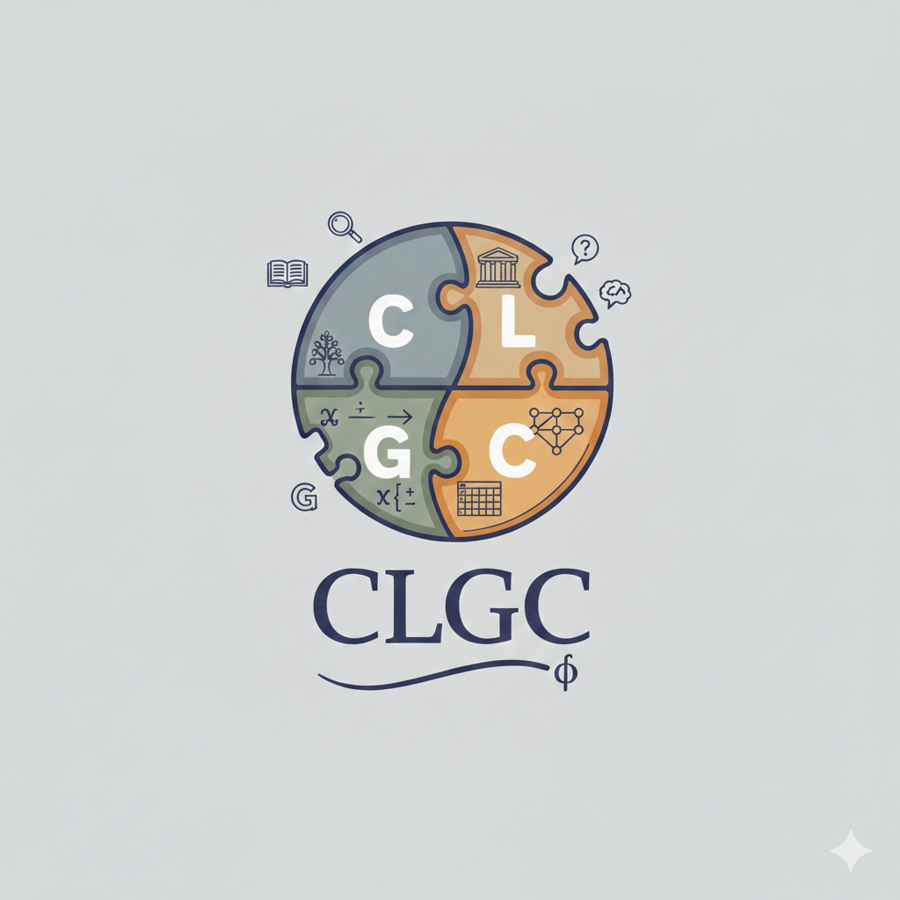

# CLGC

A Python package to translate First-Order Logic (FOL) into different knowledge representation languages

## Scope

A package used for handling logic statements and logic analysis using formal knowledge representation languages.

## Key Features
- Translate FOL statements to other formal Knowledge Representation (KR) languages
- Categorize syllogisms by type

## Supported KR Languages
- Common Logic Interchange Format (CLIF)
- Conceptual Graph Interchange Format (CGIF)
- Tensor Function Logic (TFL)
- Tensor Function Logic Plus (TFL+)
- CLINGO
- MINIFOLX

